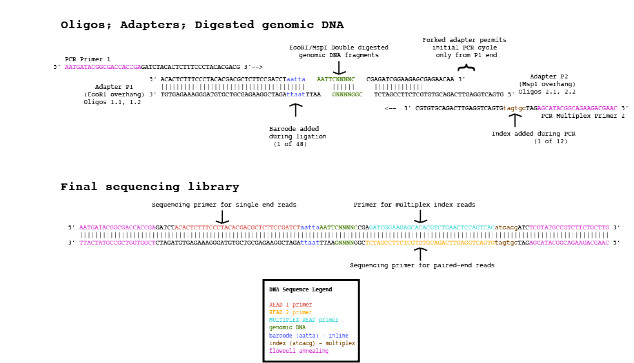

# Double Digest RADseq pipeline

## Overview

Restriction Associated DNA sequencing, or RADseq, is a method to construct reduced representation libraries from
random fragments of a genome that have been digested by restriction enzymes ([Baird et al. 2008](http://journals.plos.org/plosone/article?id=10.1371/journal.pone.0003376)). The Double Digest
RADseq (ddRADseq) method relies on combined indexing that allows for enhanced multiplexing and sequencing of a large
number of individuals ([Peterson et al. 2012](http://journals.plos.org/plosone/article?id=10.1371/journal.pone.0037135)). 
Once a ddRADseq library has been sequenced, the resulting fastQ files must be computationally parsed in an efficient manner.

The steps of the Double Digest RADseq bioinformatic pipeline can be carried out using our program **ddradseq**.
The source code is written in C and is freely available from the [GitHub website](https://github.com/dgarriga/ddradseq).
This single program can handle all three steps of a simple ddRADseq pipeline. The software has been engineered to leave
a small memory footprint, and thus, should be able to handle a large number of individuals. To accomplish this, the
**ddradseq** program runs in three different modes, corresponding to different steps in the ddRADseq pipeline. The three 
modes/steps are intended to run in a *specific order* and can be described as follows:

1. **parse**:  A this first step in the pipeline reads a database file to determine how the input fastQ sequences should be
   parsed. This step depends critically on a properly formatted text database file. For details on how to construct the
   database file, please see the **The CSV database file** subsection below.

2. **pair**: this second step in the pipeline insures that all sequences output from the first **parse** step contain mates
   that are properly aligned and ordered in the files.

3. **trimend**: this final step in the pipeline reads mate-pairs output from the preceeding **pair** stage and checks 
   the 3' end of the reverse sequences for the presence of the custom barcode adapter sequence. The adapter sequence may
   be present if the library was constructing using very fragments that are shorter than the combined resulting reads.
   When **ddradseq** is run in **trimend** mode, it performs a sequence alignment on the mate-pairs to check whether the
   reverse sequence runs past the beginning of the trimmed forward sequence. If this overhang is present, the **ddradseq**
   program will trim the overhang.

When all three steps in the pipeline have been completed, the resulting fastQ files are ready to be used in a read mapping 
or assembly pipeline.

A Makefile is provided to compile the program. The **ddradseq** program was specifically written to compile and run
on modern GNU/Linux systems and has been tested primarily on Debian- or RedHat-based distributions. It is recommended
that the program should be compiled using a version of GCC with at least a basic implementation of inline functions
from the C99 standard (> version 4.3). See the **Compiling** section below for more information.

## The ddRADseq library

The following graphic illustrates the structure of the ddRADseq library.


## Running the program

Running the base **ddradseq** program with no additional command line arguments produces the following informational
message:

```
> ./ddradseq
Usage: ddradseq [MODE] [OPTIONS] [INPUT FILES/DIRECTORY]

Valid modes are:
  parse	   Parses input fastQ by standard Illumina and custom adapter
  pair	   Aligns mated pairs in two fastQ input files
  trimend   Trims the 3' end of fastQ reverse sequences

The modes are intended to be run in the above order.
Use 'ddradseq -v' or 'ddradseq --version' to see software version
For development information, see https://github.com/dgarriga/ddradseq
Contact dgarriga@lummei.net for support.
```
## The structure of output directories

If the **ddradseq** program is run in **parse** mode and the user specifies that they want output to the existing 
file system directory "outputdir/", the program will create the following output directory structure
```
outputdir/
├── 2016-09-28
    ├── C4R08ANXX
    │   ├── JNW1b
    │   │   ├── pairs
    │   │   ├── parse
    │   │   └── trime
    │   └── JNW2b
    │       ├── pairs
    │       ├── parse
    │       └── trime
    └── C7G4NANXX
        ├── TornadoA
        │   ├── pairs
        │   ├── parse
        │   └── trime
        └── TornadoB
            ├── pairs
            ├── parse
            └── trime
```
The first level of output directories is named for the date (in YYYY-DD-MM format) on which the program was run
(e.g., "2016-09-28/" in the above example). The next level of directories are named using the Illumina flow cell
names (e.g.,"C4R08ANXX/" and "C7G4NANXX/"). The third level of output directories are named for the pool identifier
(e.g., "JNW1b/" and "JNW2b/" etc., above). Within each pool-level directory are three subdirectories that will contain
the output files from the three different stages of the pipeline. Finally, within each of these directories, the user
will find a pair of fastQ files for each individual sample. This means that the final individual sample paired fastQ
files will be found in the "trime/" folders.

## Running the program in parse mode

The **parse** mode of the **ddradseq** program can be invoked by following the program name with the name of the mode
at the command line. If the program is invoked with the additional "--help" option, the program will produce the
following output,
```
> ./ddradseq parse --help
Usage : ddradseq parse [OPTIONS] [FASTQ.R1] [FASTQ.R2]

Parse fastQ file into separate files by flowcell, barcode and/or index

Mandatory arguments to long options are mandatory for short options too.
 -c, --csv=FILE       CSV file with index and barcode labels
 -o, --out=DIR        Parent directory to write output files    [default: same as input fastQ]
 -d, --dist           Edit distance for barcode matching        [default: 1]
 -h, --help           Display this help message

For development information, see https://github.com/dgarriga/ddradseq
Contact dgarriga@lummei.net for support.
```
In **parse** mode, the program only operates on pairs of input fastQ files. Both the input forward and reverse fastQ
must be specified at the command line. Furthermore, the **ddradseq** program is able to read gzipped fastQ input files
and the program will write all output fastQ files in gzipped format. Running the program in **parse** mode on additional
sets of fastQ files with sequences from the same pool, will append the previously output fastQ files, not overwrite them.
A python helper script will be available to run **ddradseq** on all pairs of fastQ input files in a directory tree (see
**the python helper script** subsection below).

### The CSV database file

Below is an example of the comma-separated database text file:
```
> zcat out.csv.gz | head
C4R08ANXX,ATCACG,JNW1a,AATTA,1834
C4R08ANXX,ATCACG,JNW1a,ACACA,1578
C4R08ANXX,ATCACG,JNW1a,ACTGG,1833
C4R08ANXX,ATCACG,JNW1a,ACTTC,1829
C4R08ANXX,ATCACG,JNW1a,AGCTA,1579
C4R08ANXX,ATCACG,JNW1a,ATACG,1636
C4R08ANXX,ATCACG,JNW1a,ATGAG,1777
C4R08ANXX,ATCACG,JNW1a,ATTAC,1798
C4R08ANXX,ATCACG,JNW1a,CAACC,1759
C4R08ANXX,ATCACG,JNW1a,CATAT,1800
```
The database file has five fields. The first field is the Illumina flow cell identifier (as it appears in the fastQ files).
The second field is the DNA sequence of the Illumina multiplex index. The thrid field is the custom identifier associated
with the multiplex index in the previous column (the pool ID). The fourth field is the DNA sequence of the custom barcode 
that appears on the 5' end of the forward reads. The final field/column is the sample identifier that is associated with the
custom barcode sequence in the previous column (the sample ID).

### The python helper script

### Example
```
> ./ddradseq parse -c out.csv.gz -o /home/dgarriga/src/ddradseq test.R1.fq.gz test.R2.fq.gz
```

## Running the program in pair mode

Unlike **parse** mode, the **ddradseq** program running in **pair** mode wants the top-level output directory as its
main argument,
```
> ./ddradseq pair --help
Usage : ddradseq pair [OPTIONS] [PARENTDIR]

Aligns mated pairs in all fastQ files existing in a directory tree.

Mandatory arguments to long options are mandatory for short options too.
 -h, --help           Display this help message

For development information, see https://github.com/dgarriga/ddradseq
Contact dgarriga@lummei.net for support.
```
The program will search for all output fastQ files in the directory and child subdirectories and it will perform the
mate-pairing function on all such files that it finds. Subsequent runs of the program in **pair** mode will overwrite 
the results of the previous run.

### Example
```
> ./ddradseq pair /home/dgarriga/src/ddradseq/2016-09-28
```

## Running the program in trimend mode

Like, the **pair** function, **trimend** also wants the top-level parent directory as input and it will also perform
the 3' trimming function on all pairs of fastQ files that it finds. Subsequent runs of the program in **trimend** mode
will overwrite the files produced in the previous run.
```
> ./ddradseq trimend --help
Usage : ddradseq trimend [OPTIONS] [PARENTDIR]

Trims the 5' end of reverse reads in all mate pair fastQ files
in the specified directory tree. Mated pairs are aligned and any
 overhand is trimmed.

Mandatory arguments to long options are mandatory for short options too.
 -h, --help           Display this help message

For development information, see https://github.com/dgarriga/ddradseq
Contact dgarriga@lummei.net for support.
```

### Example
```
> ./ddradseq trimend /home/dgarriga/src/ddradseq/2016-09-28
```

## Compiling

A simple Makefile is provided with the **ddradseq** program. The only dependency is the zlib runtime library and headers.
On Debian-based systems, the administrator can install these using the command
```
> sudo apt install zlib1g-dev
```
Alternatively, on RedHat-based systems, the following command will install the required zlib library,
```
> sudo yum install zlib-devel
```
The source code of the program can then be compiled by typing
```
> make
```
in the program directory. The resulting executable file `ddradseq` will be created in that same directory.
The user can then place the program anywhere in their executable search path.
